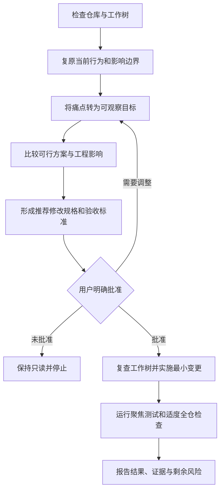

# Repo Grounded Change Skill

用于在现有代码仓库中评估并实施代码、UI、交互、重构或架构改动的 Codex Skill。它先用代码、配置和测试还原现状，再比较可行方案、形成可验收的修改规格，并且只在用户明确批准后实施。

> 适用边界：当用户已经给出直接、无歧义且不存在重大设计选择的实现任务时，通常无需使用本 Skill 的完整确认流程。

## 业务功能

| 功能 | 说明 | 主要输出 |
| --- | --- | --- |
| 现状取证 | 检查仓库、工作树、当前行为、测试和影响边界 | 现状与证据摘要 |
| 目标澄清 | 把用户痛点转换为可观察结果和约束 | 目标、保留项、待确认项 |
| 方案比较 | 比较 2–3 个互斥方案的体验、兼容性、风险和成本 | 方案表与推荐结论 |
| 修改规格 | 明确文件、接口、状态、迁移、回滚、测试和验收标准 | Codex 可执行的变更规格 |
| 受控实施 | 在用户明确批准后做最小且完整的实现 | 代码变更 |
| 验证报告 | 执行聚焦测试和适度的全仓检查 | 检查证据、限制和剩余风险 |

### 关键机制

| 机制 | 说明 |
| --- | --- |
| 证据标签 | 用 `用户目标`、`代码事实`、`文档事实`、`技术建议`、`产品假设`、`待确认`、`已确认`、`本次不改` 区分事实与判断 |
| 权威顺序 | 冲突按「用户指令 > 本次确认决定 > 批准产品规格 > 代码现状 > README/历史文档」裁决 |
| 只读门禁 | 现状取证与方案比较阶段保持只读，用户明确批准前不修改代码 |
| 最小实现 | 实施只覆盖已批准范围，不夹带无关清理 |
| 强制停止 | 出现会改变行为/范围/迁移/依赖/验收的新证据时停止并重新确认 |

## 使用场景

- 希望先评估当前功能或交互，再决定是否改造。
- 同一需求存在多种实现方式，需要比较用户体验和工程影响。
- UI、状态、数据、兼容性或架构改动需要明确确认门禁。
- 需要在实施前约定范围、保留行为、验收标准和回滚边界。
- 工作树已有用户修改，必须避免夹带无关清理或覆盖现有工作。

本 Skill 不用于 PRD 创建、只读红队评审或安全专项审计。

## 使用范例

### 范例一：先评估登录流程，确认后实施

**输入：**

```text
$repo-grounded-change 先评估当前登录流程的问题，给出方案，我确认后再修改
```

**流程：**

1. **现状取证**：Skill 检查登录相关代码、测试和配置，报告当前行为（如「密码错误统一返回 401，未区分用户不存在」）、用户影响和相关代码边界，并标注工作树已有未提交修改。
2. **目标澄清**：把「登录体验不好」转为可观察目标（如「区分账号不存在与密码错误，同时不泄露账号是否存在」），澄清会影响方案选择的点。
3. **方案比较**：给出 2 个互斥方案——方案 A 用统一的模糊提示（推荐，兼顾安全与体验），方案 B 区分错误类型（体验好但有账号枚举风险），并说明各自的安全、兼容和测试影响。
4. **修改规格**：给出推荐方案的受影响文件、错误码、兼容保留、测试计划和可观察验收标准，等待批准。
5. **受控实施**：用户回复「按推荐方案执行」后，复查工作树、做最小改动、跑聚焦测试和全仓检查。
6. **验证报告**：报告改动文件、验证证据和剩余限制。

### 范例二：比较缓存改造方案

```text
$repo-grounded-change 比较两种缓存改造方式，说明兼容性、迁移和测试影响
```

Skill 输出方案表，覆盖用户体验、既有行为保留、状态与数据兼容、可访问性、测试影响、实现工作量、回滚难度和风险，并把推荐方案放第一位并说明理由；若只有一种安全方案，则解释为何其他方案被排除，而不是编造伪选择。

### 范例三：只分析不实施

```text
$repo-grounded-change 只分析支付回调的幂等性问题，不修改代码，先给出推荐方案和验收标准
```

Skill 全程只读，交付现状、方案比较、推荐修改规格和验收标准，不触碰代码。

## 调用指令

评估后实施：

```text
$repo-grounded-change 先评估当前登录流程的问题，给出方案，我确认后再修改
```

比较方案：

```text
$repo-grounded-change 比较两种缓存改造方式，说明兼容性、迁移和测试影响
```

限定范围：

```text
$repo-grounded-change 只分析支付回调的幂等性问题，不修改代码，先给出推荐方案和验收标准
```

也可以直接提出「先分析现有仓库，再提供方案，确认后实施」等请求，Codex 可依据 `SKILL.md` 自动调用。

## 工作流程



如果实施中出现会改变已批准行为、范围、迁移、依赖或验收标准的新证据，流程会停止并请求重新确认，不会静默扩大范围。

## 业务价值

- **避免过早编码**：先确认问题和目标，再决定实现方式，减少方向性返工。
- **提高决策透明度**：把用户体验、兼容性、成本、风险和回滚难度放在同一方案比较中。
- **保护现有资产**：以当前仓库和工作树为基线，保留无关修改与既有数据语义，不夹带清理。
- **增强可验收性**：将建议转为文件范围、测试计划和可观察验收条件，验收不再靠感觉。
- **降低回归风险**：实施后用真实检查证据说明通过项、未运行项和剩余限制。
- **守住授权边界**：明确「评估不等于实施」，未经批准的方案不会被自动执行。

## 安装

```text
$HOME/.agents/skills/repo-grounded-change/SKILL.md
```

项目级安装：

```text
<项目目录>/.agents/skills/repo-grounded-change/SKILL.md
```

## 仓库结构

| 路径 | 说明 |
| --- | --- |
| `SKILL.md` | 授权边界、证据标签、七步工作流和停止条件 |
| `references/discovery-and-impact.md` | 现状取证与影响分析 |
| `references/options-and-clarification.md` | 方案比较与澄清规则 |
| `references/change-spec-and-acceptance.md` | 修改规格和验收标准 |
| `agents/openai.yaml` | Codex 中的 Skill 展示配置 |

## 相关文档

- [Skill 主说明](./SKILL.md)
- [现状取证与影响分析](./references/discovery-and-impact.md)
- [方案比较与澄清](./references/options-and-clarification.md)
- [修改规格与验收](./references/change-spec-and-acceptance.md)
- [OpenAI：Build skills](https://developers.openai.com/codex/skills)